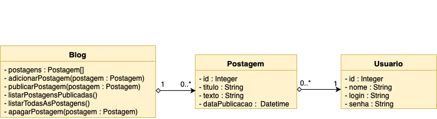

# POO - Exercício \# 2 (2º bimestre)

## Instruções
* Cada classe deverá estar um arquivo com o mesmo nome (exemplo: classe Postagem no arquivo Postagem.py)

## Exercícios:
1) Crie um programa para representa um blog. O blog contém várias postagens que são cadastradas por usuários autenticados. Siga o diagrama de classes abaixo para a implementação:

* O blog contém uma lista de postagens
* O método "listarPostagensPublicadas()" deverá listar apeanas as postagens cuja data de publicação já foi atingida. Do contrário, as postagens serão visíveis apenas pelo método "listarTodasAsPostagens()"
* Para criar uma postagem, o usuário deverá estar autenticado no sistema
* A Postagem deverá identificar o usuário que fez a sua criação.
