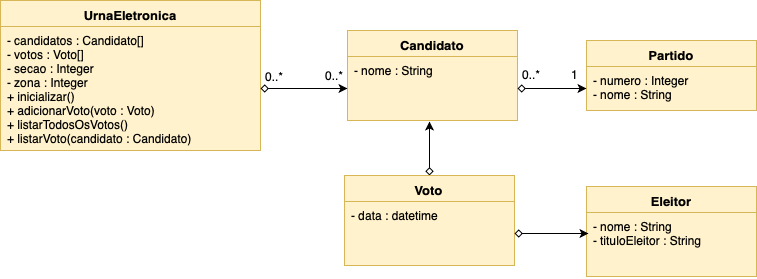

# INTIN - Programação Orientada a Objetos - Prova 2

## Urna eletrônica para eleições presidenciais do Brasil

Siga o diagrama de classes apresentado na *Figura 1* para implementar um sistema de urna eletrônica.

 *Figura 1. Diagrama de classes para implementação*

Algumas observações sobre os métodos da classe **UrnaEletronica**:
* O método **inicializar()** carregar a lista de candidatos à presidência, o número da seção e o número da zona.
* O método **adicionarVoto(voto)** deverá computar o voto de um eleitor (adicionar um item à lista de votos)
* O método **listarTodosOsVotos** deverá imprimir os seguintes dados de cada voto: data, candidato, número, nome do partido. As informações do eleitor não deverão ser exibidas.
* O método **listarVoto(candidato)** deverá imprimir os votos que um determinado candidato obteve. Deverá ser exibido primeiramente o número total de votos que o candidato obteve e em seguida a hora em que cada voto foi computado. As informações do eleitor não deverão ser exibidas.

## Respostas:
[Clique aqui](https://github.com/ifpb/intin-poo/tree/master/assets/provas/prova-2/respostas) para visualizar as respostas